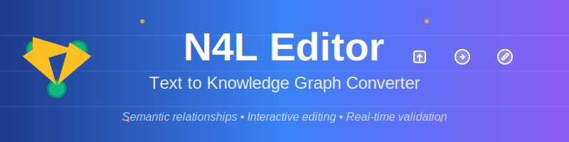

# Text to N4L Converter Frontend

A modern web interface for converting text to N4L DSL format with **real-time arrow validation** using Vite and Tailwind CSS v4.

## ✨ Key Features

### Core Functionality
- Clean, responsive UI built with Tailwind CSS v4
- Real-time text conversion via API
- **Smart file format detection**: HTML, Markdown, and plain text
- **Rendered previews**: See formatted HTML/Markdown before conversion
- File upload support (any text-based file)
- Copy to clipboard functionality
- Save edited N4L files
- **Resizable output window** (↕️ vertical resize)
- **Maximized screen usage** (90% viewport height)
- **Compact button design** for more content space
- Keyboard shortcuts (Ctrl/Cmd + Enter to convert)

### Advanced Features
- **Real-time arrow validation** for N4L syntax
- **Session persistence** for user preferences
- **Working indicators** during processing
- **Streaming implementation** for large files
- **UI state management** for optimal user experience

## 🚀 Quick Start

### Prerequisites
- Node.js 18+ 
- npm or yarn

### Development
```bash
# Install dependencies
task install
# or: npm install

# Start development server
task dev
# or: npm run dev

# Access at http://localhost:5173
```

### Production Build
```bash
# Build for production
task build
# or: npm run build

# Preview production build
task preview
# or: npm run preview
```

## 🛠 Technology Stack

- **Vite** - Fast build tool and development server
- **Tailwind CSS v4** - Utility-first CSS framework
- **Vanilla JavaScript** - No framework dependencies
- **CodeMirror** - Advanced text editing capabilities
- **Proxy Configuration** - Routes `/api/*` to Go backend

## 📁 Project Structure

```
src/
├── main.js              # Main application logic and UI
├── style.css            # Tailwind CSS imports
├── components/          # Reusable UI components
├── lib/                 # Utility libraries
└── landing.html         # Landing page

public/                  # Static assets
├── banner.svg           # Project banner
├── logo-animated.svg    # Animated logo
└── favicon.svg          # Favicon

docs/                    # Documentation
├── ARCHITECTURE.md      # System architecture
├── IMPLEMENTATION_SUMMARY.md  # Implementation details
└── ...                  # See documentation section below
```

## 📚 Documentation

### 🏗 Architecture & Implementation
- [**Architecture Overview**](docs/ARCHITECTURE.md) - System design and component structure
- [**Implementation Summary**](docs/IMPLEMENTATION_SUMMARY.md) - Detailed implementation guide
- [**Refactoring Notes**](docs/REFACTORING.md) - Code refactoring decisions and rationale

### 🎨 User Interface & Experience  
- [**UI Improvements**](docs/UI_IMPROVEMENTS.md) - Interface enhancements and design decisions
- [**UI States Visual Guide**](docs/UI_STATES_VISUAL_GUIDE.md) - Complete UI state documentation
- [**UI Cleanup Summary**](docs/UI_CLEANUP_SUMMARY.md) - Interface optimization details
- [**Working Indicator Feature**](docs/WORKING_INDICATOR_FEATURE.md) - Loading states and feedback

### ⚡ Features & Functionality
- [**N4L Editing Guide**](docs/N4L_EDITING_GUIDE.md) - Complete guide to N4L syntax and editing
- [**Arrow Validation**](docs/ARROW_VALIDATION.md) - Real-time N4L syntax validation
- [**Validation Visual Guide**](docs/VALIDATION_VISUAL_GUIDE.md) - Validation system documentation
- [**Session Persistence**](docs/SESSION_PERSISTENCE.md) - User session and preference management

### 🔧 Technical Implementation
- [**Streaming Implementation**](docs/STREAMING_IMPLEMENTATION.md) - Real-time processing architecture
- [**Streaming Summary**](docs/STREAMING_SUMMARY.md) - Streaming feature overview
- [**Streaming Visual Demo**](docs/STREAMING_VISUAL_DEMO.md) - Visual demonstration of streaming
- [**N4L Syntax Highlighting**](docs/N4L_SYNTAX_HIGHLIGHTING.md) - Syntax highlighting implementation

### 🎨 Design & Assets
- [**Logo Design**](docs/LOGO_DESIGN.md) - Logo creation and design principles
- [**Favicon Summary**](docs/FAVICON_SUMMARY.md) - Icon and favicon implementation

### 🐛 Development & Debugging
- [**Bug Fixes**](docs/BUGFIXES.md) - Known issues and their solutions
- [**Implementation Summary - Working Indicator**](docs/IMPLEMENTATION_SUMMARY_WORKING_INDICATOR.md) - Specific feature implementation

## 🔗 API Integration

The frontend connects to the text2n4l-web Go backend:
- **Backend URL**: `http://localhost:8080`
- **API Endpoint**: `/api/convert`
- **Streaming Endpoint**: `/api/stream`

## 📱 Browser Support

- Chrome/Chromium 90+
- Firefox 88+
- Safari 14+
- Edge 90+

## 🤝 Development Workflow

1. **Start Backend**: `task web-dev` (from project root)
2. **Start Frontend**: `task editor-dev` (from project root or here)
3. **Access Application**: http://localhost:5173
4. **API Proxy**: Frontend automatically proxies `/api/*` to backend

## 📄 License

Part of the SSTorytime project - see main project license.

---

**Version**: 1.1  
**Last Updated**: October 14, 2025  
**Status**: ✅ Production Ready